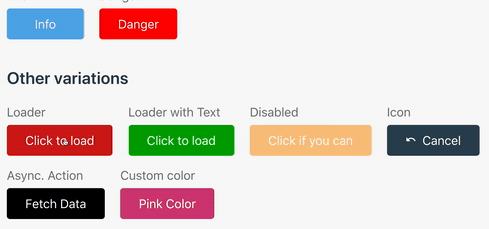

# Vuetton

Vuetton is a simple library which lets you configure your button in the most feasible way. It supports click events, asynchronous operations, icons, loaders, custom classes etc.

[https://www.npmjs.com/package/vuetton](https://www.npmjs.com/package/vuetton)



## Installation via npm

```bash
npm install --save vuetton
```

## Options
Below are the options which can be used in order to customise the button as per your needs.

| Property | Type | Description |
|---------|--------|-------------|
|action | `Function` | This is a required property which accepts the reference of a function.|
|async | `Boolean` | When ```async``` is true, the button will be disabled while still showing the loading icon until promise wrapped around the action is resolved. 
|color | `String` | This property determines the ```background-color``` of button.|
|custom-class | `String` | This property assigns additional custom class to the button component.|
|disabled | `Boolean` | If this property is true, then the particular button will be disabled.| 
|loader-text|`String`| This property accepts text which will be loaded during an asynchronous call.|
|loader-image|`String`| This property accepts path of an image which will be loaded during an asynchronous call.|
|size|`String`| This property determines the size of a button; possible values taken are ```lg```,```md```, ```sm``` and ```x-sm```. If not provided, default size i.e medium is rendered.|
|text|`String`| This is a required property which defines a value.|  
|type|`String`| This property determines the usage of button; possible values used are ```submit```,```button``` ```reset```.|


## Usage

* Import the Vuetton component from node_modules.

```js
import Vuetton from 'vuetton';
```
* Use in your template
```vue
<Vuetton size="lg" type="button" text="lg" :action="fetchTasks"></Vuetton>
```

* More Features are coming soon
* Documentation link is coming soon 
